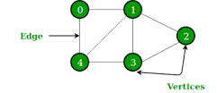

# Graphs
Interconnected Nodes. Superset of trees.



## Use
1. Social Network
2. Networks
3. Google Maps
4. Recommendation Engines

## Graphs vs Trees:
In trees, for going from one node to another, there is only one path whereas for graphs, there may be multiple paths.

## Terminology
1. **Vertice**: Nodes of the graph
2. **Edge**: Connections between nodes
3. **Directed Graph**: Graph in which we can traverse an edge in only one way. Eg: Instagram Followers Graph
4. **Undirected Graph**: Graph in which nodes can be traversed in both directions. Eg: Facebook Friends Graph
5. **Unweighted Graph**: Edges have no value associated with them.
6. **Weighted Graph**: Edges have some value associated with them.

## Representing Graphs
There are two ways of representing graphs:

1. Adjacency Matrix:

Is a matrix of size VxV where V is the number of Vertices.
The matrix for the above graph would be:
```
		0	1	2	3	4
	=======================
	0	0	1	0	0	1
	
	1	1	0	1	1	1

	2	0	1	0	1	0

	3	0	1	1	0	1

	4	1	1	0	1	0

```

2. Adjacency List:

Graph is stored in a list or hashmap:
```javascript
[
	[1, 4],//0
	[4, 3, 2],//1
	[1, 3],//2
	[1, 4, 2],//3
	[0, 1, 3],//f
]

{
	0 : [1, 4], 
	1 : [4, 3, 2], 
	2 : [1, 3],
	3 : [1, 4, 1], 
	4 : [0, 1, 3], 
}
```

## Complexity Comparision
1. Add Vertex:

Matrix: O(v<sup>2</sup>)
List: O(1)

2. Add Edge:

Matrix: O(1)
List: O(1)

3. Remove Vertex:

Matrix: O(v<sup>2</sup>)
List: O(v + e)

4. Remove Edge:

Matrix: O(1)
List: O(e)

5. Query:

Matrix: O(1)
List: O(v + e)

6. Storage:

Matrix: O(v<sup>2</sup>)
List: O(v)