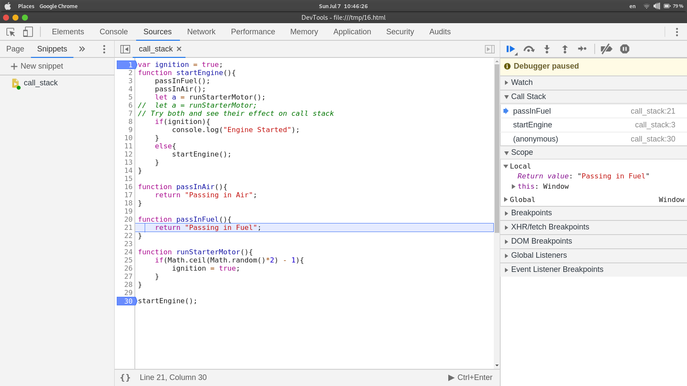

# Recursion
A recursive function is one which calls itself while executing. It works on the divide and conquer strategy. Every recursive function must have a base case to end the recursiveness.

## Example
**Sum of Numbers**
```javascript
function sumOfNum(number){
	if(number === 1){
		return 1;
	}
	return number + sumOfNum(number-1);
}
```

## Call Stack
Call stack is a stack data structure which handles the function execution in javascript. It works on Last in First Out (LIFO)

### Experiment
Try out the following code in the chrome dev console as a snippet and watch the call stack. Add a breakpoint at ```startEngine()``` and then step one by one and observe the call stack.
```javascript
var ignition = true;
function startEngine(){
    passInFuel();
    passInAir();
    let a = runStarterMotor();
//  let a = runStarterMotor;
// Try both and see their effect on call stack
    if(ignition){
        console.log("Engine Started");
    }
    else{
        startEngine();
    }
}

function passInAir(){
    return "Passing in Air";
}

function passInFuel(){
    return "Passing in Fuel";
}

function runStarterMotor(){
    if(Math.ceil(Math.random()*2) - 1){
        ignition = true;
    }
}

startEngine();
```

> Note: Call Stacks have a limit to their size which is browser dependent. After the call stack size exceeds the limit, the execition will stop and throw an error. This is known as **Stack Overflow!**

## Helper Method Recursion
In this type, recursive method is defined and called inside a main method.
### Example
Write a function that takes in an array and outputs an array with only odd numbers of the previous array.
1. With Helper Method Recursion

```javascript
function getEven(array){
	let result = [];
	function addIfEven(array){
		if(array.length == 0)return;
		if(array[0]%2==0)result.push(array[0]);
		addIfOdd(array.slice(1));
	}
	addIfOdd(array);
	return result;
}
```

2. With Pure Recursion Method
```javascript
function getEven(array){
	let newArray = []
	if(array.length==0)return [];
	if(array[0]%2==0)newArray.push(array[0]);
	newArray = newArray.concat(getEven(array.slice(1)));
	return newArray;
}
````
